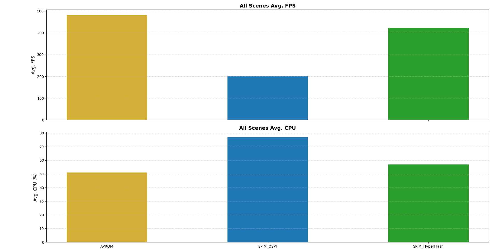

# M55M1 XIP (eXecute-In-Place) LVGL Port

## Overview

This project demonstrates running LVGL on the M55M1 IC-verification board with application code stored and executed directly from **external flash** via XIP (eXecute-In-Place). By placing the LVGL application in external flash, the limited internal flash (APROM) is freed for the bootloader, allowing larger GUI applications to run on the M55M1.

## Architecture

The project uses a **dual-image architecture**:

| Image | Source | Description |
|-------|--------|-------------|
| **XIP_Loader** | `xip_lodaer.c` | Bootloader in APROM. Initializes SPIM and DMM, then jumps to XIP image. |
| **XIP_Benchmark** | `xip_benchmark.c` | LVGL application in external flash. Starts FreeRTOS and runs demos. |

### Supported External Flash Types

| Macro | Flash Type |
|-------|------------|
| `DEF_USE_SPIM_NORFLASH` | SPI NOR Flash (QSPI) |
| `DEF_USE_SPIM_HYPERFLASH` | HyperFlash |

## Project Structure

| File / Folder | Description |
|---------------|-------------|
| `xip_lodaer.c` | XIP Loader — system clock, SPIM/DMM init, jump to XIP region |
| `xip_benchmark.c` | XIP Application — DMA350, FreeRTOS, and LVGL entry point |
| `lv_conf.h` | LVGL configuration (resolution, color depth, fonts, etc.) |
| `lv_glue.h` | Platform glue header |
| `lv_demo.c` | Demo selection (Benchmark or Widgets) |
| `lv_port_disp.c` | LVGL display driver port |
| `lv_port_indev.c` | LVGL input device driver port |
| `GenChart.py` | Reads `XiP.xlsx` and generates performance comparison charts |
| `XiP.xlsx` | LVGL Benchmark results for each flash configuration |
| `Keil/` | Keil MDK5 project files and scatter files |
| `BIN/` | Pre-built XIP Loader binaries |

## Build & Flash

### Keil MDK5 Projects

| Project | Description |
|---------|-------------|
| `Keil/XIP_Loader.uvprojx` | Builds the bootloader (APROM). Pre-built binaries in `BIN/`. |
| `Keil/XIP_Benchmark.uvprojx` | Builds the LVGL XIP application for external flash. |

### Pre-built Binaries

| Binary | Description |
|--------|-------------|
| `BIN/xip_loader_norflash.bin` | XIP Loader for SPI NOR Flash (QSPI) |
| `BIN/xip_loader_hyperflash.bin` | XIP Loader for HyperFlash |
| `BIN/xip_benchmark_aprom.bin` | XIP Benchmark running from APROM |
| `BIN/xip_benchmark_spim.bin` | XIP Benchmark running from external SPIM flash |

### Steps

1. Flash the appropriate **XIP_Loader** binary into APROM (or build `XIP_Loader.uvprojx`).
2. Build **XIP_Benchmark** and program the output into external SPI flash.
3. On reset, the loader initializes DMM and jumps to the LVGL application in external flash.

## Benchmark Results

LVGL Benchmark (v9.5.0) was run on M55M1 at 640×480 resolution with 16-bit color depth. The chart below shows the **All Scenes Average** for each flash configuration:



| Configuration | Avg. FPS | Avg. CPU |
|---------------|:--------:|:--------:|
| APROM (Internal Flash) | 482 | 51% |
| SPIM_HyperFlash | 422 | 57% |
| SPIM_QSPI | 201 | 77% |

- **APROM** delivers the best performance as code executes from internal flash with no XIP overhead.
- **HyperFlash** achieves ~88% of APROM FPS, benefiting from higher bus bandwidth than QSPI.
- **QSPI** shows the highest CPU utilization due to slower flash read throughput, resulting in ~42% of APROM FPS.

> Detailed per-scene data is available in `XiP.xlsx`. Run `GenChart.py` to regenerate the chart.

## Compiling Options

- **Partial update** is applied by default.
- **Helium (MVE) SIMD acceleration** is enabled.
- GDMA hardware acceleration is available but **disabled** by default. Uncomment `LV_USE_DRAW_GDMA` in `lv_conf.h` to enable it.
- `CONFIG_LV_DEF_REFR_PERIOD` is set to **1** (ms). This minimizes the LVGL display refresh interval so the rendering pipeline runs as fast as possible, allowing the benchmark to measure true peak FPS without being throttled by a longer refresh period.

## Memory Layout (ITCM / DTCM)

Cortex-M55 provides zero-wait-state tightly coupled memories. Performance-critical code and data are placed in these regions to maximize XIP throughput.

| Region | Address | Size | Purpose |
|--------|---------|------|---------|
| **ITCM** | `0x0000_0010` | 64 KiB | Instruction TCM — time-critical code |
| **DTCM** | `0x2000_0000` | 128 KiB | Data TCM — vector table, task stacks, fast data |

### ITCM Contents

Code placed in ITCM is defined in the scatter files (`Keil/M55M1_XIP_SPIM.scatter` and `Keil/M55M1_XIP_APROM.scatter`). There are two categories:

#### 1. FreeRTOS Kernel (object files linked into ITCM)

| Object File | Module | APROM | SPIM |
|-------------|--------|:-----:|:----:|
| `tasks.o` | Task scheduler | Y | Y |
| `list.o` | Linked list | Y | Y |
| `queue.o` | Queue / semaphore / mutex | Y | Y |
| `port.o` | Cortex-M55 port layer | Y | Y |
| `portasm.o` | Context switch assembly | Y | Y |
| `timers.o` | Software timers | — | Y |
| `heap_4.o` | Heap allocator | — | Y |

> In the APROM configuration, `timers.o` and `heap_4.o` are commented out to save ITCM space since code executes from internal flash with lower latency.

#### 2. LVGL Functions (via `LV_ATTRIBUTE_FAST_MEM` → `ITCM` section)

In `lv_conf.h`, `LV_ATTRIBUTE_FAST_MEM` is defined to place performance-critical LVGL functions into the ITCM section:

```c
#define LV_ATTRIBUTE_FAST_MEM   __attribute__((section("ITCM")))
```

This covers functions across the following LVGL source files:

| Category | Source Files |
|----------|-------------|
| Memory / String | `lv_string_builtin.c`, `lv_string_clib.c` (`lv_memcpy`, `lv_memset`, etc.) |
| Color Operations | `lv_color.c`, `lv_color_op.c` (color mixing, premultiply, etc.) |
| Math | `lv_math.c` (trigonometry, square root, etc.) |
| SW Blend | `lv_draw_sw_blend.c`, `lv_draw_sw_blend_to_rgb565.c`, `lv_draw_sw_blend_to_rgb888.c`, `lv_draw_sw_blend_to_argb8888.c`, `lv_draw_sw_blend_to_al88.c`, `lv_draw_sw_blend_to_a8.c`, `lv_draw_sw_blend_to_l8.c`, `lv_draw_sw_blend_to_i1.c`, etc. |
| SW Drawing | `lv_draw_sw_letter.c`, `lv_draw_sw_line.c`, `lv_draw_sw_mask.c`, `lv_draw_sw_box_shadow.c`, `lv_draw_sw_grad.c` |
| Draw Primitives | `lv_draw_label.c`, `lv_draw_line.c`, `lv_draw_rect.c`, `lv_draw_mask.c`, `lv_draw_blur.c` |

### DTCM Contents

| Content | Section | Description |
|---------|---------|-------------|
| Vector table | `DTCM.VTOR` | ARM exception vectors (712 bytes) |
| FreeRTOS TCBs & stacks | `DTCM.Init` | Idle, timer, and LVGL task stacks |
| Initialized data | `DTCM.Init` | Global/static variables with initial values |
| Zero-init data | `.bss.DTCM.ZeroInit` | BSS data |
| Runtime stack | `ARM_LIB_STACK` | Main call stack (grows downward from end of DTCM) |

```c
/* Initialized data */
__attribute__((section("DTCM.Init"), aligned(8))) static StaticTask_t idle_tcb;
__attribute__((section("DTCM.Init"), aligned(8))) static StackType_t idle_stack[256];

/* Zero-initialized data */
__attribute__((section(".bss.DTCM.ZeroInit"))) static uint32_t my_buffer[64];
```

### Scatter File Layout (Keil)

```
DTCM (0x20000000, 128 KiB)
├── DTCM.VTOR          ← Vector table
├── DTCM.Init          ← FreeRTOS TCBs + task stacks
├── .bss.DTCM.ZeroInit ← Zero-init data
└── ARM_LIB_STACK      ← Stack (top of DTCM, grows down)

ITCM (0x00000010, ~64 KiB)
├── FreeRTOS .o files  ← Kernel code (RO)
└── ITCM section       ← LV_ATTRIBUTE_FAST_MEM functions
```
