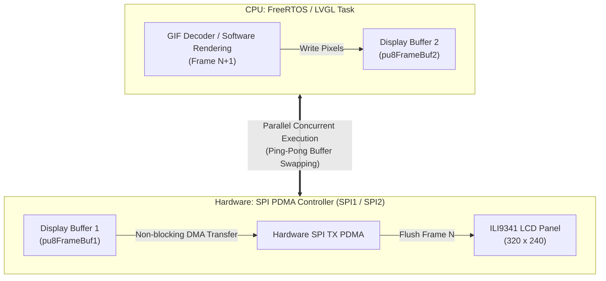

# **NuMaker-HMI-M3334 GIF Playback on SPI NOR Flash (FAT)**

This application demonstrates LVGL GIF animation playback from an on-board SPI NOR Flash (FAT filesystem) on the NuMaker-HMI-M3334 board with **dual display buffers** providing **parallel rendering (GIF decoding) and display flush (SPI PDMA)**.

## **Architecture Overview**

1. **Dual Display Buffer (`LV_DISPLAY_RENDER_MODE_PARTIAL`)**:
   - `pu8FrameBuf1` (25,600 bytes, 40 lines, heap-allocated)
   - `pu8FrameBuf2` (25,600 bytes, 40 lines, heap-allocated)
   - Registered via `lv_display_set_buffers()` and `lv_display_set_flush_wait_cb()`.
2. **Non-blocking SPI PDMA Flush**:
   - `lv_port_disp_flush_cb()` initiates hardware SPI PDMA transfer and immediately yields control back to LVGL.
   - When LVGL renders into the inactive buffer, SPI PDMA flushes the active buffer simultaneously.
   - When the PDMA transfer completes, the PDMA ISR calls `lv_display_flush_ready()` and releases the FreeRTOS semaphore.
3. **SPI NOR Flash FAT Filesystem**:
   - **NuFUN**: QSPI0 interface on pins PC0 (MOSI0), PC1 (MISO0), PC2 (CLK), PC3 (SS), PC4 (MOSI1), PC5 (MISO1).
   - **NuTFT**: QSPI0 interface on pins PA0 (MOSI0), PA1 (MISO0), PA2 (CLK), PA3 (SS), PA4 (MOSI1), PA5 (MISO1).
   - Uses `SpiFlash_QPI_FastRead` (Fast Read Quad I/O, Command 0xEB) with 4-bit data transfer for high-speed sector reading.
   - FatFs disk driver with 4096-byte sector size.
   - Logical drive `A:` mounted directly on SPI NOR Flash.
   - Automatically scans and carousels (輪播) all GIF animations found on drive `A:`.
   - Plays each GIF animation completely to its final frame before smoothly transitioning to the next GIF.
   - If mounting fails or no GIF file is found, the UI displays a `"Mount Fail!"` message and activates CherryUSB MSC export.
   - Use [fat/make_fat_image.bat](fat/make_fat_image.bat) to build `fat_root.bin` from files in [fat/root/](fat/root/).
4. **CherryUSB MSC Storage Export (Manual Trigger & Auto Mount Failure)**:
   - Integrated CherryUSB device stack ([thirdparty/CherryUSB](../../thirdparty/CherryUSB)) with Nuvoton M3331 HSUSBD driver ([misc/CherryUSB-port](../CherryUSB-port)).
   - **NuFun PH4 Manual Trigger**: On boot, reads GPIO pin `PH.4`. If `PH4 == 0` (e.g. user button pressed / active-low), forces entry into CherryUSB MSC mode to export the SPI NOR Flash as a High-Speed USB drive. If `PH4 == 1`, normal GIF playback execution proceeds.
   - **Auto Mount Failure Export**: When SPI NOR Flash mounting fails (`fatfs_spinor_init() != 0`), CherryUSB MSC is automatically initialized to export the SPI NOR Flash as a USB Mass Storage drive (High-Speed 480 Mbps) to the host PC.
   - The user can connect the board's High-Speed USB port to a PC to format the drive or directly write GIF files without external flash programmers.

## **KEIL project**

User can select listed **Target Name** to build target execution using uVision MDK5.

| Target | Description |
|-|-|
| M3334KI_NUFUN | Use ILI9341 SPI LCD panel (SPI1) + QSPI0 NOR Flash on PC0~PC5 |
| M3334KI_NUTFT | Use ILI9341 SPI LCD panel (SPI2) + QSPI0 NOR Flash on PA0~PA5 |

## **Resources & Pin Map**

### **NuFUN**
- **ILI9341 SPI LCD**:
  - Controller: SPI1
  - MOSI: PE0, MISO: PE1, CLK: PH8, CS: PH9
  - DC: GH10, RST: GD14, Backlight: GH11
- **SPI NOR Flash (QSPI0)**:
  - Controller: QSPI0 (PC0..PC5)
  - MOSI0: PC0, MISO0: PC1, CLK: PC2, CS: PC3, MOSI1: PC4, MISO1: PC5

### **NuTFT**
- **ILI9341 SPI LCD**:
  - Controller: SPI2
  - MOSI: PA8, MISO: PA9, CLK: PA10, CS: PA11
  - DC: GB2, RST: GB3, Backlight: GB5
- **SPI NOR Flash (QSPI0)**:
  - Controller: QSPI0 (PA0..PA5)
  - MOSI0: PA0, MISO0: PA1, CLK: PA2, CS: PA3, MOSI1: PA4, MISO1: PA5
  - Footprint: U1 on NuTFT LCM panel module (supports SOIC-8, e.g. Winbond W25Q32JV / 4MB, identical to NuFUN).
  - **Hardware Modification Requirement**:
    - **Remove Damping Resistors**: Remove the damping resistors located on the D1/D2 signal lines.
    - **Bridge Solder Pads**: Bridge the resistor solder pads with 0 $\Omega$ jumpers or solder bridges to directly connect the MCU QSPI signals (PA4 / PA5) to the flash `/WP` (Pin 3) and `/HOLD` (Pin 7) pins.
    - **Why this is critical**: The damping resistors cause signal level degradation and keep `/WP` at a floating/low level, which activates Winbond hardware write protection (`SR1 = 0xFC`). When write protection is active, Windows cannot format the flash drive in USB MSC mode. Bridging the pads and applying firmware unprotect allows complete write/erase access (`SR1 = 0x00`).

### **Blank Flash Setup Workflow (NuTFT / NuFUN)**

When replacing or soldering a new, unformatted SPI NOR Flash on the board:
1. Solder the flash chip on the U1 footprint and complete the NuTFT hardware pad bridge modification above.
2. Build and flash the `M3334KI_NUTFT` firmware target.
3. On first boot, the blank flash contains no filesystem, so FatFs mount fails (`res = 13: FR_NO_FILESYSTEM`), displaying `"Mount Fail!"` on screen.
4. The system automatically launches CherryUSB Mass Storage mode (HSUSBD 480 Mbps).
5. Connect the board's High-Speed USB port to a Windows PC. The PC detects the `NuMaker M3334 Flash Disk`.
6. Right-click the drive in Windows and format it as **FAT** or **FAT32** (4096-byte allocation unit).
7. Copy your desired `.gif` animation files into the root directory of the USB drive.
8. Press the Reset button on the board. The system mounts the filesystem and begins playing the GIF carousel automatically.

## **Resources**

- Technical Q&A: [QA.md](./QA.md)
