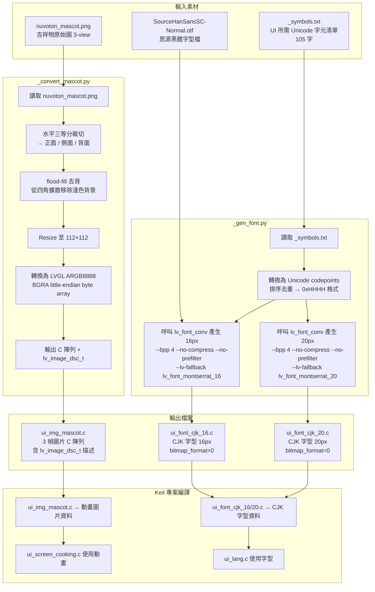
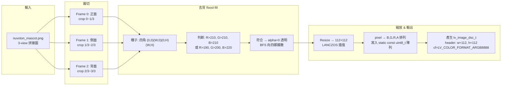
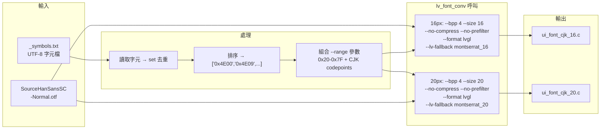

# Rice Cooker UI 專案開發紀錄

## 專案概要

- **平台**: NuMaker-HMI-M3334 (Nuvoton M3334)
- **顯示**: 320×240 TFT LCD, 16-bit color, SPI 介面
- **框架**: LVGL 9.4.0 + FreeRTOS
- **IDE**: Keil MDK
- **AI 輔助開發**: GitHub Copilot (Claude Opus 4.6)

---

## 一、使用者需求 (Prompts)

### 1. 產品需求提取
> 讀取 PPTX 簡報檔，產生「產品需求.md」文件

### 2. UI 程式碼產生
> 根據產品需求，產生 LVGL 9.4.0 UI 程式碼，放在 `ui_files/` 目錄下，包含：
> - Home (待機) 畫面
> - Menu (選單) 畫面
> - Cooking (烹煮中) 畫面
> - Finish (完成) 畫面
> - 狀態列 / 軟鍵列 helper

### 3. 觸控支援
> 加入觸控按鈕 (Touch Button)，讓使用者可以直接用觸控操作

### 4. 字型放大
> 畫面字體太小，加大字型；統一所有語言字體大小 (normal=16px, large=20px)

### 5. 實體按鍵整合
> 加入實體 GPIO 按鍵掃描 (UP / DOWN / MENU / START)，含 debounce

### 6. Buzzer 蜂鳴器
> 烹飪完成時發出嗶嗶聲提示 (3 聲，非阻塞式 LVGL timer)

### 7. RTC 時鐘顯示
> 狀態列右上角顯示 RTC 即時時鐘，格式為 `YYYY/MM/DD HH:MM:SS`，每秒更新

### 8. 多語言支援
> 支援五種語言切換：English / 日本語 / 繁體中文 / 한국어 / Deutsch
> - 字串表 (string table) 架構
> - `ui_lang_next()` 循環切換
> - Home 畫面右下角 Language 按鈕

### 9. CJK 字型產生
> 使用 `lv_font_conv` 產生 CJK 自訂字型：
> - `ui_font_cjk_16.c` (16px)
> - `ui_font_cjk_20.c` (20px)
> - 包含所有 UI 使用的中日韓文字元 + 德文特殊字元 (105 字)
> - 字型來源: SourceHanSansSC-Normal.otf
> - 使用 `--no-compress --no-prefilter`，bitmap_format=0 (與內建字型一致)
> - Fallback 設定為 Montserrat，確保 LVGL 符號可顯示
> - 使用 Python 腳本 `_gen_font.py` 以 `--range 0xHHHH` 方式傳遞 codepoint，避免 PowerShell 編碼問題

### 10. Performance Monitor 動態切換
> 加入 `lv_sysmon_show/hide_performance()` 動態切換功能
> - Home 畫面左下角「PERF」按鈕
> - `ui_perf_monitor_toggle()` 公開 API

### 11. Cooking 畫面吉祥物動畫
> - Nuvoton 吉祥物 3 幀轉身動畫 (正面→側面→背面→側面)
> - 圖片大小 112×112 px，ARGB8888 格式（去背、透明背景）
> - 使用 flood-fill 從四角去背，保留人物白色部分
> - 300ms/幀 循環播放
> - Python 轉換腳本: `_convert_mascot.py`

### 12. 跑馬燈提示文字
> 所有語言介面底部 softkey hint bar 強制跑馬燈滾動
> - `LV_LABEL_LONG_SCROLL_CIRCULAR` 模式
> - 寬度 280px，動畫 5000ms/循環

### 13. PC Simulator (所見即所得)
> 建立 PC 端 SDL2 模擬器，在電腦上預覽 UI layout 與測試觸控/按鍵功能
> - 使用 LVGL 內建 SDL2 driver，320×240 視窗像素精確對應 LCD
> - 滑鼠左鍵 = 觸控點擊，鍵盤 M/↑/↓/Enter = 實體按鍵
> - `ui_files/*.c` 在 PC 與 MCU 之間共用，零修改
> - `sim_stubs.c` 提供 buzzer/clock/keypad 的 PC stub
> - `build_emulator.ps1` 一鍵建置腳本 (自動安裝 WinLibs + SDL2)
> - SDL event watcher + deferred dispatch 解決按鍵 re-entrancy 問題
> - 明確呼叫 `lv_sdl_mouse_create()` 啟用滑鼠觸控模擬

---

## 二、問題回報與修復紀錄

### Bug #1: Hardfault on Finish 畫面
**現象**: 進入 Finish 畫面時發生 HardFault  
**原因**: Cooking 畫面的 timer callback 在 `ui_switch_state(UI_STATE_FINISH)` 後仍嘗試存取已刪除的 label 物件  
**修復**:
- 在 `cooking_timer_cb` 中先刪除 timer 再切換狀態
- 所有 label 指標加上 NULL guard

### Bug #2: Menu 選單捲動問題
**現象**: 上下鍵選擇超出可視範圍時，畫面沒跟著捲動  
**修復**: 加入 `lv_obj_scroll_to_view(s_items[idx], LV_ANIM_ON)`

### Bug #3: Menu 上下鍵不循環
**現象**: 到頂/底時按上/下鍵無反應  
**修復**: 改為 circular wrap-around 邏輯

### Bug #4: CJK 文字顯示為框框 (□)
**現象**: 切換到日文/中文模式時，部分文字顯示為方框  
**原因** (多階段修復):
1. 字型的 symbols list 不完整 → 重新產生包含所有字的字型
2. 字型 `.fallback = NULL` → 改為 fallback 到 `lv_font_montserrat_16/20`
3. 狀態列/軟鍵列使用 hardcoded Montserrat → 改用 `ui_lang_font_normal()`
4. 按鈕 label 未設定字型 → 加入 `lv_obj_set_style_text_font()`

### Bug #5: Language 按鈕與 RTC 重疊
**現象**: Home 畫面右上角 Language 按鈕與 RTC 時鐘文字重疊  
**修復**: 將 Language 按鈕移至右下角 (softkey bar 上方)

### Bug #6: npm SSL 憑證錯誤
**現象**: `npm install -g lv_font_conv` 失敗，SSL cert error  
**修復**: `npm config set strict-ssl false`

### Bug #7: 德文字串 hex escape 編譯錯誤
**現象**: `ui_lang.c` 中德文字串如 `"Wei\xc3\x9fer"` 產生 "hex escape sequence out of range" 錯誤  
**原因**: `\x9f` 後接合法 hex 字元 `e`，編譯器貪婪解析為 `\x9fe`  
**修復**: 拆分字串字面值，如 `"Wei\xc3\x9f" "er Reis"`

### Bug #8: 非英文介面顯示空白
**現象**: 韓文/繁中/日文切換後文字完全空白  
**原因**: 
1. PowerShell 傳遞 `--symbols` 時 Unicode 字元損失 → 改用 `--range 0xHHHH`
2. `lv_font_conv` 預設壓縮 (bitmap_format=1)，LVGL 未啟用解壓 → 加 `--no-compress`
3. `#if defined(UI_FONT_CJK_AVAILABLE)` 在 Keil 編譯時可能不可見 → 移除條件編譯  
**修復**: 使用 `_gen_font.py` 以明確 codepoint range + `--no-compress` 產生字型

### Bug #9: 吉祥物去背後臉/手變黑
**現象**: 簡單的 `rgb > 200` 門檻把人物白色部分也去掉了  
**修復**: 改用 flood-fill 從四角擴散移除背景，不影響人物本體白色

### Bug #10: PC Simulator 鍵盤按鍵無反應
**現象**: 按 M/Up/Down/Enter 鍵時，UI 沒有反應  
**原因**: `SDL_GetKeyboardState()` 輪詢方式無效，因 LVGL SDL driver 內部 `SDL_PollEvent()` 已消費鍵盤事件  
**修復**: 改用 `SDL_AddEventWatch()` 註冊事件回調攔截 `SDL_KEYDOWN`，並使用 ring buffer + LVGL timer 做 deferred dispatch 避免 re-entrancy

### Bug #11: PC Simulator 滑鼠點擊無反應
**現象**: 滑鼠點擊按鈕無效，無法觸發 `LV_EVENT_CLICKED`  
**原因**: `lv_sdl_window_create()` 只建立 display，不會自動建立 mouse indev  
**修復**: 明確呼叫 `lv_sdl_mouse_create()` 建立 pointer indev

---

## 三、檔案結構

```
pc_simulator/
├── build_emulator.ps1    -- 一鍵建置腳本 (安裝 WinLibs + SDL2 + build)
├── CMakeLists.txt        -- CMake 建構腳本 (Ninja + MinGW)
├── lv_conf.h             -- PC 專用 LVGL 設定 (SDL2, No OS)
├── main.c                -- SDL2 視窗 + 鍵盤映射 (event watcher)
├── sim_stubs.c           -- 硬體 stub (buzzer→printf, clock→PC time)
└── README.md

ui_files/
├── ui.h                  -- 公開 API (state enum, key enum, init, toggle)
├── ui.c                  -- 狀態機、按鍵分派、初始化、perf toggle
├── ui_common.h           -- 顯示幾何、色彩定義、cook context struct
├── ui_helpers.c          -- 狀態列、軟鍵列 helper (跑馬燈)
├── ui_screen_home.c      -- Home 待機畫面 (語言/PERF 按鈕)
├── ui_screen_menu.c      -- Menu 選單畫面 (circular scroll)
├── ui_screen_cooking.c   -- Cooking 烹煮畫面 (吉祥物動畫 + countdown)
├── ui_screen_finish.c    -- Finish 完成畫面 (buzzer, keep warm)
├── ui_keypad.c           -- GPIO 按鍵掃描 (20ms timer, debounce)
├── ui_buzzer.h / .c      -- 蜂鳴器驅動 (GPIO toggle, non-blocking)
├── ui_clock.h / .c       -- RTC 時鐘 (YYYY/MM/DD HH:MM:SS, 1s update)
├── ui_lang.h / .c        -- 多語言字串表 & 字型選擇 (5 語言)
├── ui_img_mascot.h / .c  -- 吉祥物動畫圖片 (3 幀, 112x112, ARGB8888)
├── ui_font_cjk_16.c      -- CJK 自訂字型 16px (無壓縮)
├── ui_font_cjk_20.c      -- CJK 自訂字型 20px (無壓縮)
├── _gen_font.py          -- 字型產生腳本
├── _convert_mascot.py    -- 吉祥物圖片轉換腳本
└── _symbols.txt          -- 字型所需的 Unicode 字元清單
```

---

## 四、編譯設定重點 (`lv_conf.h`)

| 設定項 | 值 | 說明 |
|--------|-----|------|
| `LV_USE_OS` | `LV_OS_FREERTOS` | 使用 FreeRTOS |
| `LV_COLOR_DEPTH` | 16 | 16-bit 色彩 |
| `LV_FONT_MONTSERRAT_12/16/20/24` | 1 | 啟用基本字型 |
| `UI_FONT_CJK_AVAILABLE` | 1 | 啟用 CJK 字型 |
| `LV_USE_SYSMON` | 1 | 系統監控 |
| `LV_USE_PERF_MONITOR` | 1 | FPS/CPU 監控 (runtime 可切換) |
| `CONFIG_LV_MEM_SIZE` | 128KB | LVGL 記憶體池 |

---

## 五、操作方式

### 實體按鍵
| 按鍵 | 功能 |
|------|------|
| MENU | 進入選單 / 返回 |
| UP | 上移選擇 |
| DOWN | 下移選擇 |
| START | 確認 / 開始烹煮 |

### 觸控按鈕
| 畫面 | 按鈕 | 功能 |
|------|------|------|
| Home | Menu | 進入選單 |
| Home | EN/JA/ZH/KO/DE | 切換語言 |
| Home | PERF | 切換效能監控顯示 |
| Menu | 項目 | 選擇烹煮模式 |
| Menu | Back | 返回 Home |
| Cooking | Pause | 暫停 (吉祥物動畫同步暫停) |
| Cooking | Stop | 停止 |
| Finish | Home | 返回 Home |

---

## 六、Cooking 畫面佈局

```
┌─ Status Bar (YYYY/MM/DD HH:MM:SS) ─┐
│  [Mode: White Rice]   ┌────────────┐│
│  25:30                │            ││
│  98.5 °C              │  mascot    ││
│                       │  112x112   ││
│                       └────────────┘│
│   [⏸ Pause]        [✕ Stop]        │
└─ Softkey Bar (跑馬燈) ─────────────┘
```

---

## 七、Python 腳本工具流程圖

### 整體資源產生流程



---

### `_convert_mascot.py` 詳細流程



---

### `_gen_font.py` 詳細流程



---

### 關鍵參數說明

| 參數 | 用途 |
|------|------|
| `--bpp 4` | 每像素 4 bits (16 級灰階抗鋸齒) |
| `--no-compress` | 不壓縮 bitmap → `bitmap_format=0`，避免 LVGL 需啟用解壓器 |
| `--no-prefilter` | 不做前置濾波，搭配 no-compress 使用 |
| `--lv-fallback` | 指定 fallback 字型，確保 ASCII 及 LVGL 符號 (▶ ⏸ 等) 可顯示 |
| `--range 0x20-0x7F` | 包含基本 ASCII 範圍 |
| `FRAME_W/H = 112` | 吉祥物動畫幀尺寸 (配合 320×240 螢幕右半區域) |
| `Image.LANCZOS` | 高品質縮放插值法 |
| `CF_ARGB8888 (BGRA)` | LVGL little-endian 32-bit 色彩格式，含 alpha 透明通道 |

---

## 八、開發時間統計

### 各階段耗時

| 階段 | 內容 | 估計耗時 |
|------|------|----------|
| 需求提取 | PPTX → 產品需求.md | ~10 min |
| UI 程式碼產生 | 5 個畫面 + helpers | ~20 min |
| 觸控 & 按鍵 | touch button + GPIO keypad | ~15 min |
| 字型 & 多語言 | 5 語言 + CJK 字型產生 | ~40 min |
| CJK Bug 修復 | Bug #4~#8 多次迭代 (編碼/壓縮/條件編譯) | ~50 min |
| RTC & Buzzer | 時鐘顯示 + 蜂鳴器 | ~10 min |
| Perf Monitor | FPS toggle 功能 | ~5 min |
| 吉祥物動畫 | 圖片轉換 + 去背 + 動畫邏輯 | ~30 min |
| 佈局調整 | 字型統一、跑馬燈、版面微調 | ~15 min |
| PC Simulator | SDL2 模擬器 + 除錯 (mouse/key) | ~30 min |
| 文件整理 | report.md + 流程圖 | ~15 min |
| **總計** | | **~4 – 4.5 小時** |

### 與傳統開發方式對比

| 方式 | 預估時間 |
|------|----------|
| AI 輔助 (本次) | **~4 小時** |
| 純人工開發 (同等功能) | ~3–5 天 (24–40 工時) |

**加速比約 6–10 倍**，主要節省於：
- 樣板程式碼撰寫 (LVGL API 查找 + 狀態機架構)
- CJK 字型工具鏈除錯 (PowerShell 編碼、bitmap_format 問題)
- 跨語言字串表建立 (105 字 codepoint 收集)
- 圖片轉換腳本從零撰寫
