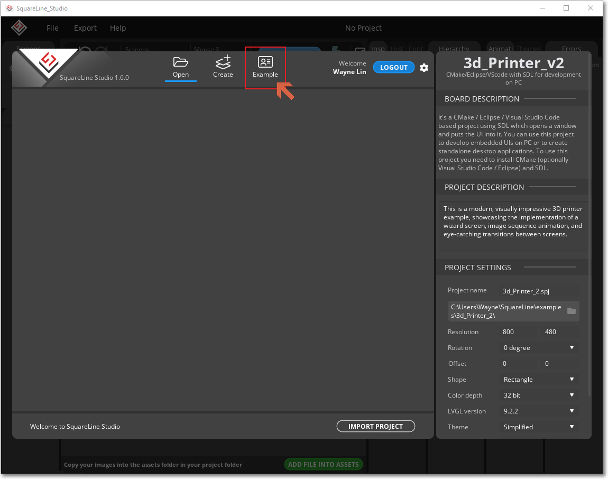
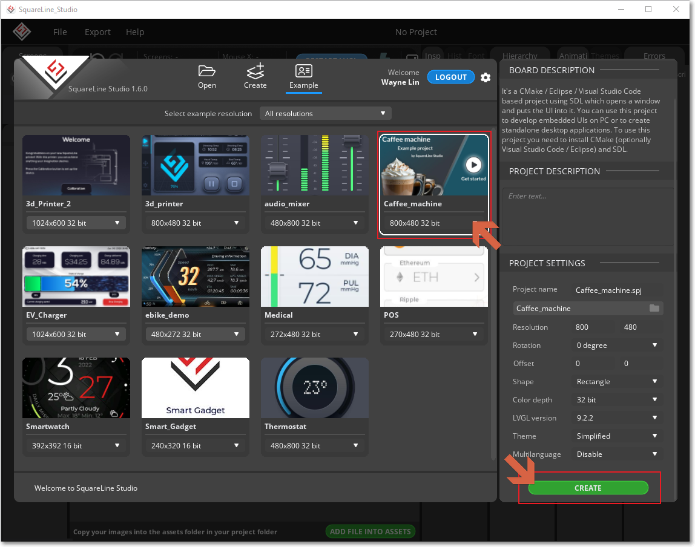
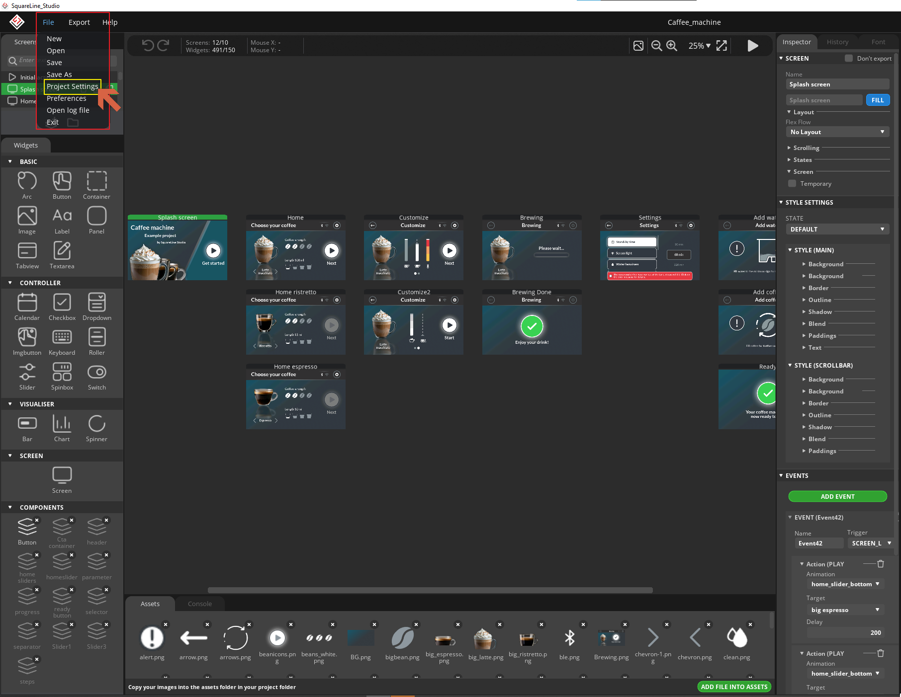
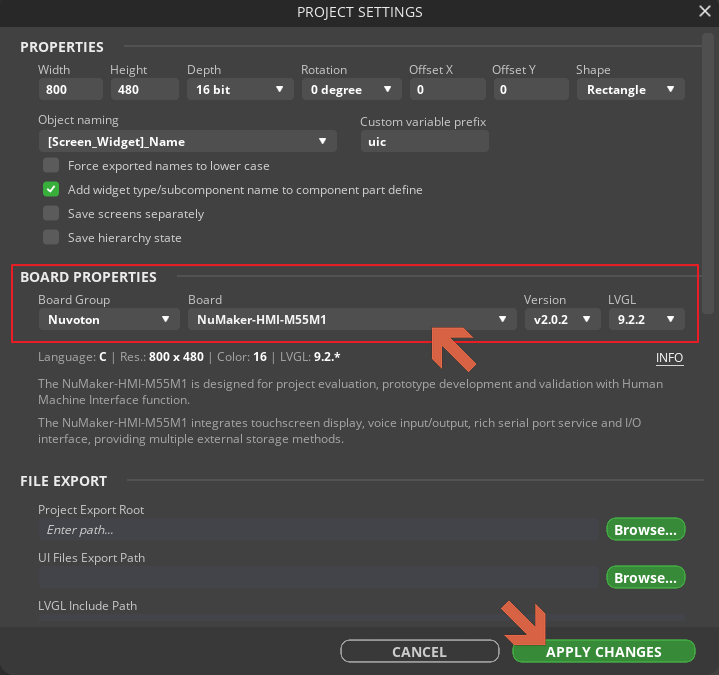
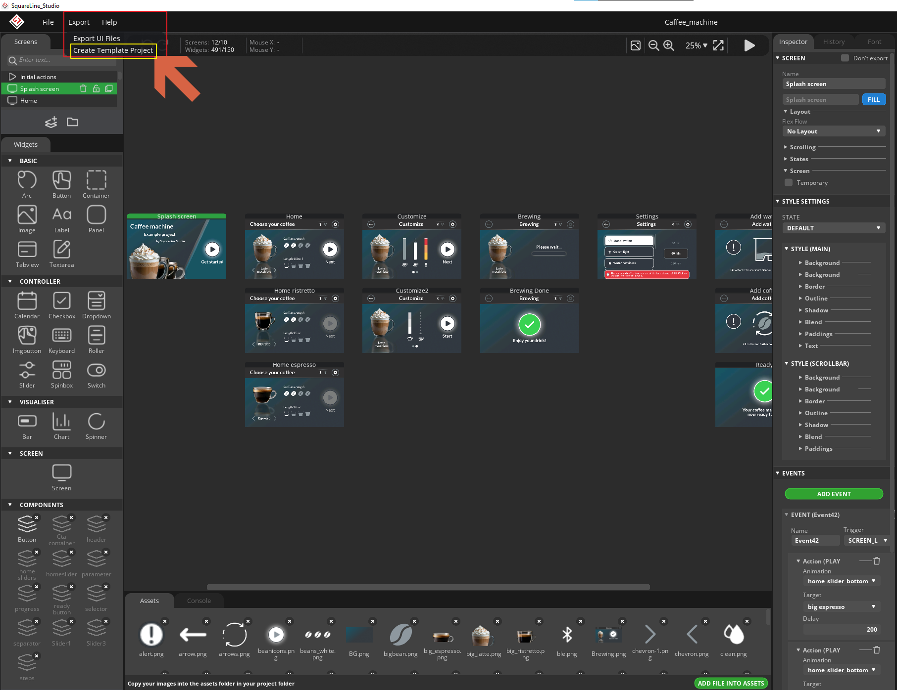
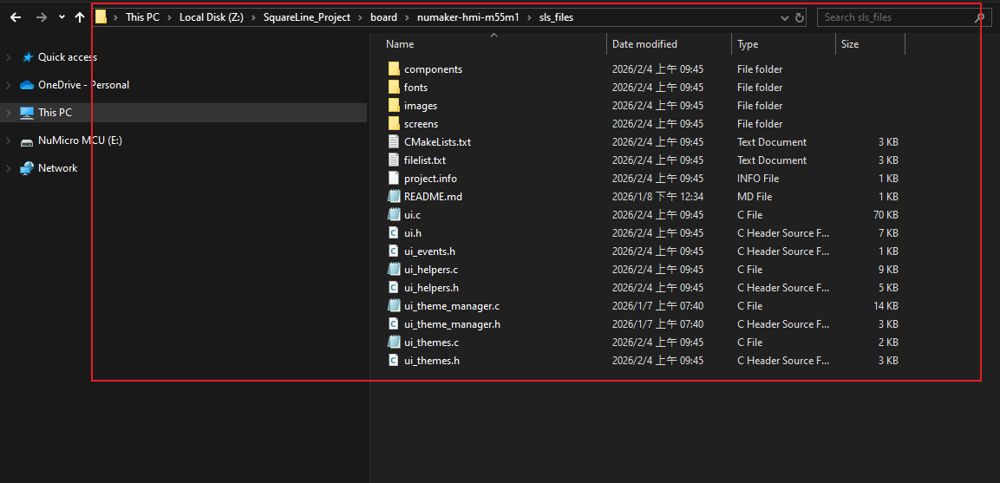

# To export SLS example C sources

Use SquareLine Studio v1.6.0 and follow below steps:

## Step 1

To click the “Example” button to list all SLS examples.



## Step 2

To click the “Caffe Machine” item and click “CREATE” button to import the example in your workspace.



## Step 3

To click the “File” and ”Project Settings” items to select the target board. Finally, to click “APPLY CHANGE”.

- **Board Group**: Nuvoton
- **Board**: NuMaker-HMI-M55M1





## Step 4

To click the “Export” and ”Create Template Project” items to export C source project.



## Step 5

Found the SLS examples exported source folder as below.
   **<SLSPrj>/board/numaker-hmi-m55m1/sls_files**.



## Step 6

Manually import all C source files in the `sls_files` folder into the Keil MDK project. In lv_conf.h, to define the **LV_ATTRIBUTE_MEM_ALIGN** definition as below. This declaration will collect all RO-Data array UI assets at **.spim_data** section.

```c
#define LV_ATTRIBUTE_MEM_ALIGN  __attribute__((section(".spim_data"), aligned(32), used))
```

## Step 7

In the **M55M1.scatter** file, define **LR_ROM_2** as shown below. This declaration remaps the **.spim_data** section to the **SPIM0** start address.

```c
#define SPIM0_START     0x82000000
#define SPIM0_SIZE      0x02000000

LR_ROM_2 SPIM0_START
{
      SPIM SPIM0_START SPIM0_SIZE
      {
         * (.spim_data)
      }
}
```

**Notice**:

- The **lv_port_nuvoton** repository is already aligned with **LVGL v9.4.0**, which is different from the SLS alignment (**v9.3.0**). Therefore, users should copy the **sls_files** into the **lv_port_nuvoton** folder.
